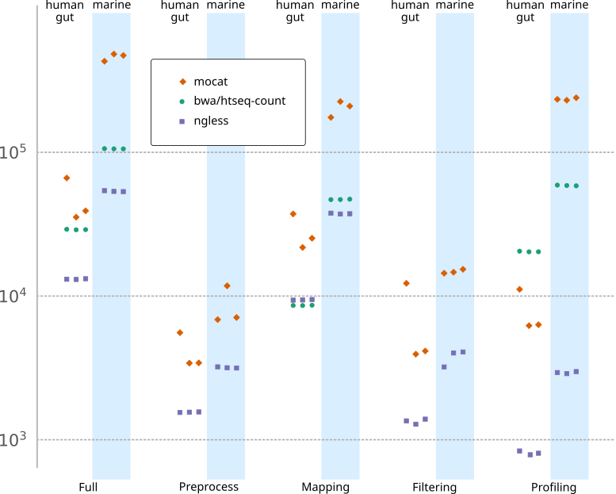

# NGLess Benchmarking

This repository includes code for benchmarking [ngless](https://ngless.embl.de).

This is a companion repository to:

> _NG-meta-profiler: fast processing of metagenomes using NGLess, a
> domain-specific language_ by Luis Pedro Coelho, Renato Alves, Paulo Monteiro,
> Jaime Huerta-Cepas, Ana Teresa Freitas, and Peer Bork _in_ Microbiome 7:84 (2019)
> [http://doi.org/10.1186/s40168-019-0684-8](http://doi.org/10.1186/s40168-019-0684-8)

## Reproducing

### From scratch

1. Download all data: run the script `download-data.py`. This will download
from ENA into a directory `data/` (this process can take several hours and will
result in ca. 60GiB of data).

### Using the precomputed results

1. Precomputed data is available in `data/precomputed`
2. The script `sources/plot-comparison.py` generates the comparison plot

